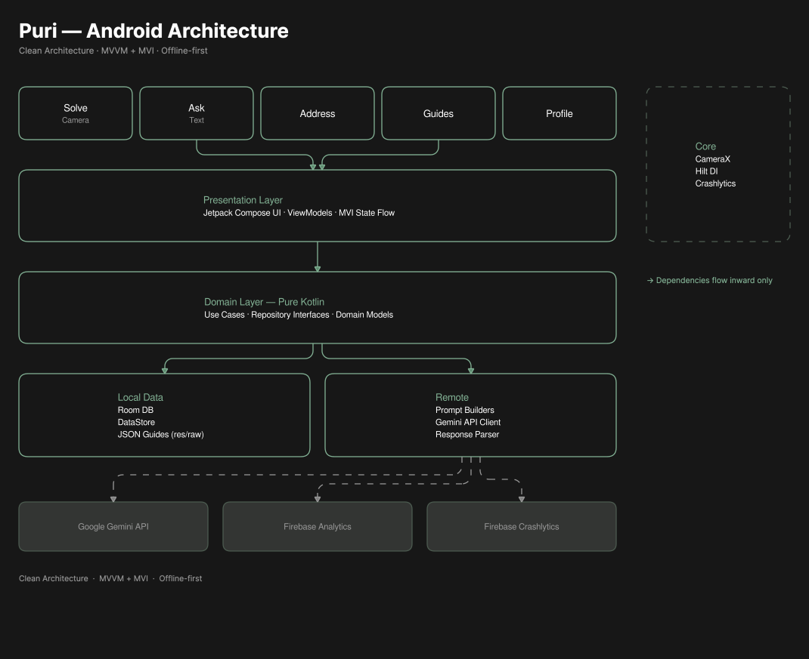
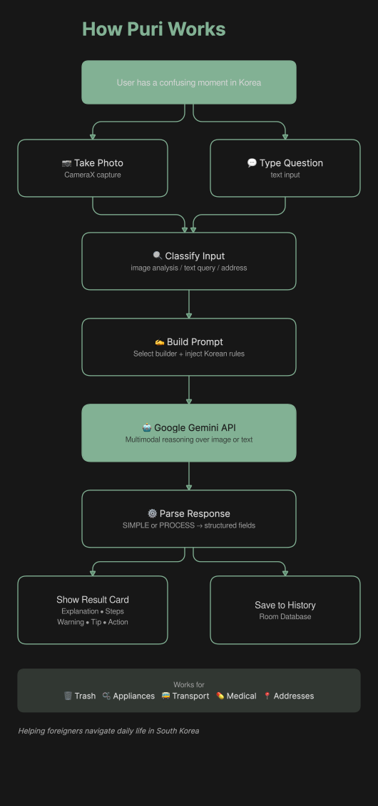

# Puri (풀이)

**Daily life assistant for foreigners in South Korea.**

Point your camera at anything confusing in Korea — trash bins, washing machine buttons,
bus signs, appliances, menus — and get an instant AI explanation in English.
Built for foreigners living in Korea.

---

## Features

- **📷 Snap & Solve** — Point camera at anything confusing. Get contextual, actionable AI analysis in seconds.
- **💬 Ask Anything** — Text queries about daily life, transport, food, medical situations, and more.
- **📍 Address Converter** — Any Korean address format → Naver Map + Kakao Map ready.
- **📚 12 Offline Guides** — Trash sorting, subway, bus, medical, appliances and more. No internet needed.
- **🌙 Dark + Light theme** — Full system theme support with celadon design palette.
- **No account required** — Solve history stays on your device only.

---

## Tech Stack

| Layer | Technology |
|---|---|
| Language | Kotlin |
| UI | Jetpack Compose + Material 3 |
| Architecture | Clean Architecture + MVVM + MVI |
| DI | Hilt |
| Local storage | Room + DataStore |
| Networking | Retrofit + OkHttp |
| Serialization | kotlinx.serialization |
| AI | Google Gemini API (multimodal) |
| Camera | CameraX |
| Image loading | Coil |
| Analytics | Firebase Analytics |
| Crash reporting | Firebase Crashlytics |
| Auth | Firebase Anonymous Auth |
| Min SDK | API 26 (Android 8.0) |

---

## Architecture

Puri follows **Clean Architecture** with a strict unidirectional dependency rule:
`Presentation → Domain ← Data`. The Domain layer has zero Android dependencies.

<p align="center">
  
</p>

## How Puri Works

<p align="center">
  
</p>

### Key design decisions

**MVI + MVVM** — ViewModels expose `uiState: StateFlow<UiState>` and
`effects: Flow<UiEffect>` for one-time events. UI dispatches `Intent` objects.
No direct state mutation from the UI layer.

**`flatMapLatest` for solve state** — `_activeState: MutableStateFlow<SolveUiState?>`.
When null, `idleData` (Room + DataStore `combine`) streams live. When non-null
(Loading, Success, Error etc.), `idleData` is completely unsubscribed — preventing
race conditions between solve results and live database emissions.

**Dual-format AI responses** — Prompts produce either `SIMPLE` format (translations,
yes/no, single-item disposal) or `PROCESS` format (appliance operation, multi-step
tasks, medical). `GeminiResponseParser` detects format at parse time rather than
forcing a fixed structure on all responses.

**Offline-first guides** — 12 JSON files in `res/raw/` loaded by `GuideContentLoader`
with in-memory LRU cache. `noCompress += "json"` prevents build-time compression.
All guide content available with zero network dependency.

---

## Getting Started

**Requirements:** Android Studio Hedgehog or later, JDK 17

```bash
git clone https://github.com/SonaliSulgadle/puri-android
cd puri-android
```

Add to `local.properties`:

GEMINI_API_KEY=your_gemini_api_key
GEMINI_API_KEY_DEBUG=your_debug_key

Add `google-services.json` from Firebase Console to the `app/` directory.

Run on a physical device or API 26+ emulator.

---

## Web companion

[puri-address.vercel.app](https://puri-address.vercel.app) — standalone address
converter tool. Paste any Korean address format, get a Naver Map + Kakao Map
ready result. Built with Next.js, deployed on Vercel.

---

## License

Source available for portfolio and educational viewing.  
Commercial use, redistribution, or derivative works require explicit written permission.

© 2026 Sonali Sulgadle